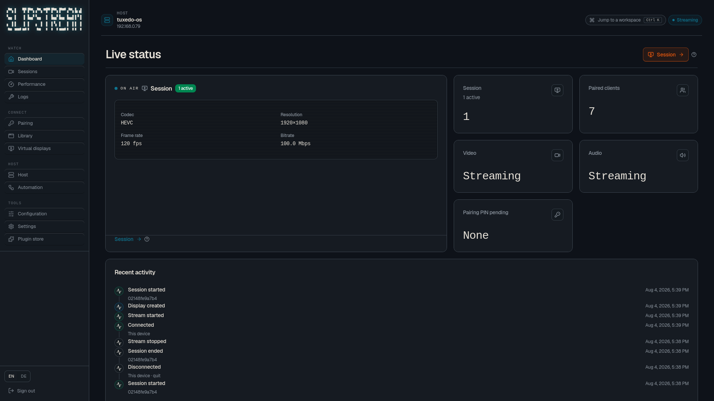
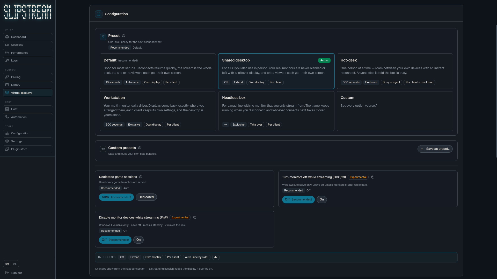
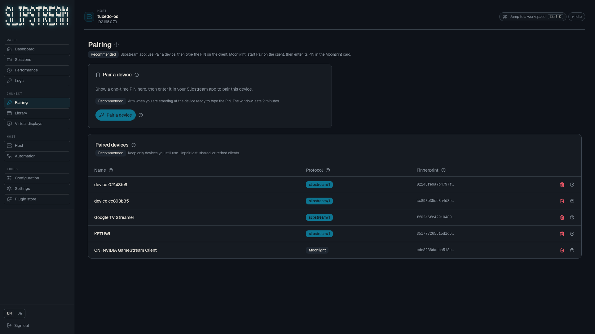
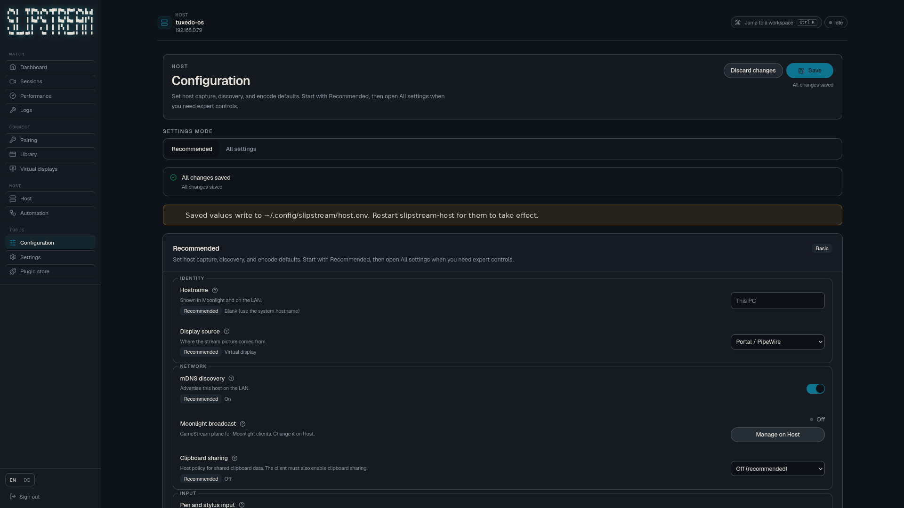
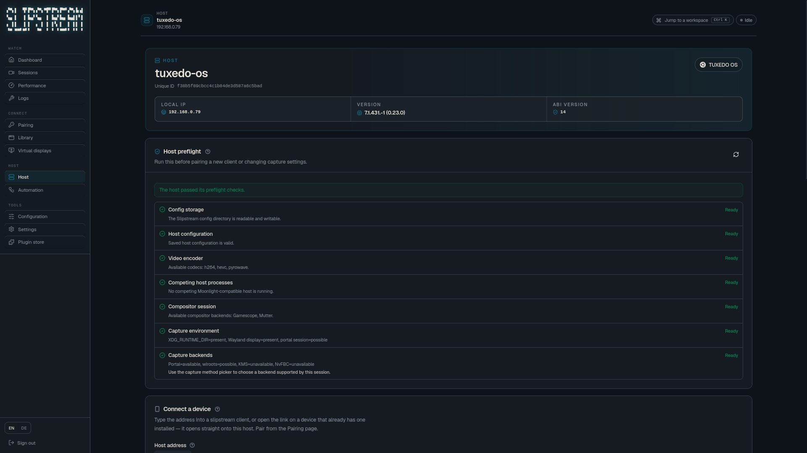
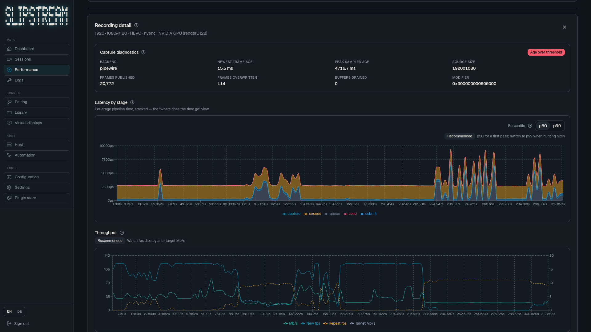

<div align="center">
<pre style="display: inline-block; text-align: left;">
▞▀▖▌  ▜▘▛▀▖▞▀▖▀▛▘▛▀▖▛▀▘▞▀▖▙▗▌
▚▄ ▌  ▐ ▙▄▘▚▄  ▌ ▙▄▘▙▄ ▙▄▌▌▘▌
▖ ▌▌  ▐ ▌  ▖ ▌ ▌ ▌▚ ▌  ▌ ▌▌ ▌
▝▀ ▀▀▘▀▘▘  ▝▀  ▘ ▘ ▘▀▀▘▘ ▘▘ ▘
</pre>
</div>

<p align="center"><b>Low-latency desktop and game streaming for Linux hosts. Play from the couch, or use your real desktop at work.</b></p>

<p align="center">
  <a href="#what-it-is">What it is</a> ·
  <a href="#highlights">Highlights</a> ·
  <a href="#console">Console</a> ·
  <a href="#how-it-works">How it works</a> ·
  <a href="#install">Install</a> ·
  <a href="#connect-a-client">Connect</a> ·
  <a href="#developing">Developing</a> ·
  <a href="#license">License</a>
</p>

<p align="center">
  
</p>

---

## What it is

Slipstream turns a Linux machine into a private **desktop and game streaming** host. Install the
host, pair a client once, and stream to any screen on your LAN or VPN at that screen's own
resolution and refresh rate. Games on the couch, or your real desktop from an office laptop. No
accounts, no cloud relay, no subscription.

Three pieces work together: a **host** that creates a per-client virtual display, captures it,
encodes it, and streams it; **clients** for iPhone, Android, and the Steam Deck, plus any
[Moonlight](https://moonlight-stream.org/) client through GameStream you enable; and a **browser
console** that manages pairing, displays, the game library, plugins, and settings.

## Highlights

| Feature | What it means |
|---|---|
| Per-client virtual display | Exact WxH@Hz for every device, no letterboxing. |
| Play and work on the same host | Games to a TV or Deck, or the full desktop from the office. |
| Display policy you control | Keep a game alive across disconnects, dedicate a couch box, or extend the desktop. |
| GPU-first encode | Zero-copy where the platform allows it, with VAAPI and software fallbacks. |
| Self-filling library | Steam titles plus plugins (ROM Manager, VirtualHere, ...), no scanning by hand. |
| PIN pairing, no accounts | SPAKE2 once, then pinned identities, mDNS discovery. |

## Console

Manage the host from a browser: pairing, virtual-display presets, live sessions, and the plugin
store.

<p align="center">
  
</p>

<p align="center">
  
</p>

<p align="center">
  
</p>

<p align="center">
  
</p>

<p align="center">
  
</p>

## How it works

```
compositor → capture → encode → FEC → network → decode → present
```

Each client gets its own virtual output at an exact WxH@Hz, so a 4K TV and a 1080p phone can
watch the same host at the same time, each rendered natively. The host speaks **GameStream** for
Moonlight clients and **`slipstream/1`**, the native plane with QUIC control, UDP data, and
built-in forward error correction. Latency numbers: [stats overlay](docs-site/content/docs/stats.md).

## Install

Local and private setup is the default. Build from source, or use the packages under
[`packaging/`](packaging/).

```sh
# Host
cargo build -p slipstream-host
./target/debug/slipstream-host serve --mgmt-bind 127.0.0.1:47990

# Console (dev)
cd web && bun install && bun run dev   # http://127.0.0.1:47992
```

Packaged installs (apt, rpm, Arch, Bazzite, Flatpak) live under `packaging/` with their own
READMEs. Point package URLs and update feeds at your own registry when you publish.

## Connect a client

| Device | Client |
|--------|--------|
| iPhone | `clients/apple` |
| Android | `clients/android` |
| Steam Deck | Decky plugin or Flatpak |
| Scripts | `slipstream` CLI (`clients/cli`) |
| Anything else | Moonlight over GameStream |

Pairing is a one-time PIN. Per-distro packages and host tips: [docs site](docs-site/content/docs/).

## Status

| Piece | State |
|-------|-------|
| `slipstream-core` + C ABI | Complete |
| GameStream → Moonlight | Live (opt-in `--gamestream` on trusted LAN) |
| `slipstream/1` native path | Live |
| Linux host | Live |
| iPhone / Android / Steam Deck clients | Streaming |
| Web console (`web/`) | Live over the OpenAPI mgmt API |

Bare `slipstream-host serve` is **native-only** (`slipstream/1` + mgmt/console). Add
`--gamestream` only on a LAN you trust.

## Developing

```sh
cargo build --workspace
cargo test  --workspace --locked
cargo clippy --workspace --all-targets --locked -- -D warnings
cargo fmt --all --check
```

Extra dev commands (the FEC loss harness and the standalone C-ABI proof):

```sh
cargo run -p loss-harness
bash crates/slipstream-core/tests/c/run.sh
```

The C header regenerates into `include/slipstream_core.h` on build. iPhone and Android clients
have their own toolchains. Repo **layout**, **design invariants**, and the contribution guide:
[CONTRIBUTING.md](CONTRIBUTING.md).

## License

MIT OR Apache-2.0. See [LICENSE-MIT](LICENSE-MIT), [LICENSE-APACHE](LICENSE-APACHE), and
[CONTRIBUTING.md](CONTRIBUTING.md).

Third-party notices for shipped binaries: [`THIRD-PARTY-NOTICES.txt`](THIRD-PARTY-NOTICES.txt).
Historical copyright lines for earlier lineage (where required) live in [NOTICE](NOTICE).

### Trademarks

Slipstream is independent and is not affiliated with NVIDIA, Microsoft, Sony, Valve, or Moonlight.
"GameStream", "Moonlight", "Xbox", "DualSense", "DualShock", and "PlayStation" are trademarks of
their owners and are used only to describe interoperability.
