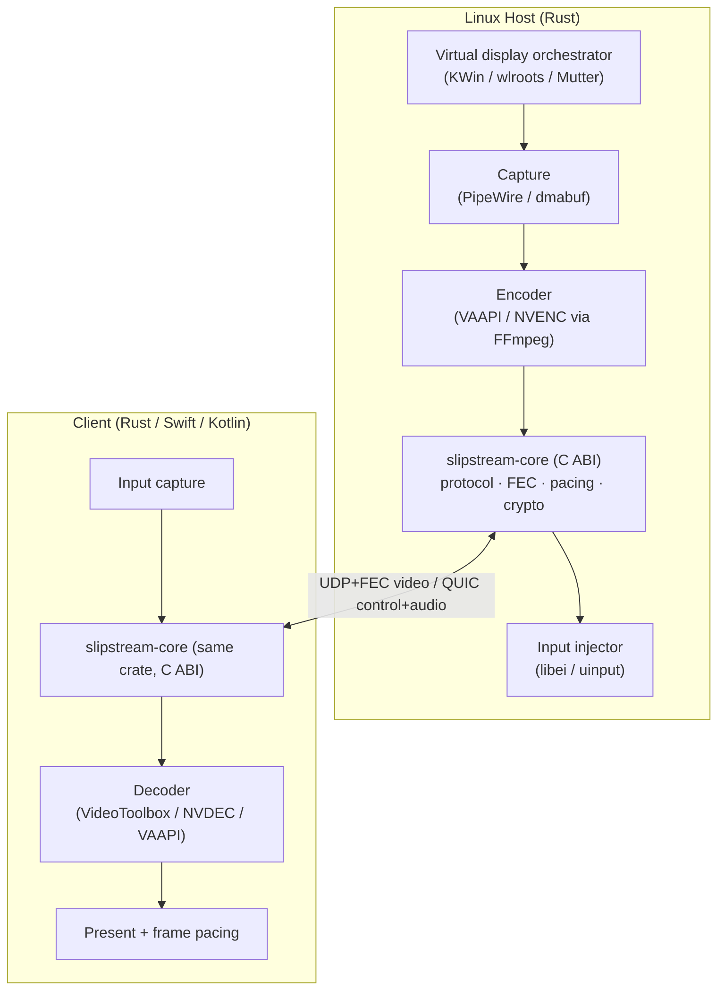

*A ground-up low-latency desktop streaming stack, built Linux-first, with a shared Rust protocol core and native clients per platform.*

> The name `slipstream` fits the lowercase house style (`unom`, `played`, `remplir`) and reads as "glass-to-glass light," which is the whole point.

---

## 0. The thesis (why this is worth building)

Two concrete gaps justify a new project rather than another fork:

1. **The 1 Gbps wall is a FEC design limit, not a bandwidth limit.** Moonlight/Sunshine protect each frame with Reed–Solomon over GF(2⁸), which caps a block at 255 shards. At 5120×1440@240 that ceiling is hit around 1 Gbps. Switching the erasure code to **Leopard-RS over GF(2¹⁶)** (via the `reed-solomon-simd` crate) raises the per-block shard limit to 65,536 and runs in O(n log n) with SIMD. The wall disappears as a *consequence* of a better core, not as a hack.

2. **Linux software virtual displays are a real, unfilled gap.** The compositor-side capability now exists (Mutter headless virtual monitors since GNOME 40; wlroots headless outputs; KWin virtual outputs in Plasma 6), but no streaming host *drives* those APIs to create a client-sized output on demand, capture it via PipeWire, and route input back via libei. Apollo's virtual display is Windows-only. This is the immediate, shippable win.

**Strategic ordering:** ship the Linux virtual-display host speaking the *existing* Moonlight protocol first (every Moonlight/Artemis client works on day one, no client to write). Only then introduce the new GF(2¹⁶) transport as a negotiated protocol extension with our own clients. Value early, hard parts deferred until de-risked.

---

## 1. Scope & non-goals

**In scope (eventually):**
- Linux streaming host with on-demand software virtual displays (KWin first, then wlroots, then Mutter).
- A shared Rust protocol/transport/FEC core exposed over a stable C ABI.
- A modern transport that removes the 1 Gbps ceiling.
- Native clients: Rust (Linux), Swift (macOS/iOS), Kotlin (Android) — all linking the same core.

**Explicit non-goals (at least at first):**
- Windows *host* support (Sunshine/Apollo already do this well; no gap to fill).
- Internet/NAT-traversal relay infrastructure (LAN/VPN first; lean on an existing mesh VPN such as Headscale/NetBird/Tailscale).
- Reinventing encoders/decoders (bind to FFmpeg + vendor SDKs; never rewrite codecs).
- A bespoke compositor (drive existing ones; only consider a dedicated headless compositor as a *deployment mode*, see §6).

---

## 2. Architecture overview



**The load-bearing decision:** `slipstream-core` is one crate, compiled once, linked by every host and client through a C ABI. Protocol logic, FEC, packet pacing, jitter buffering, pairing, and crypto live there and exist exactly once. Platform code (capture, encode, decode, present, input, UI) lives outside the core and is written in whatever language suits the platform.

---

## 3. Protocol strategy (three phases)

| Phase | Protocol | Clients that work | Bitrate ceiling | Purpose |
|------|----------|-------------------|-----------------|---------|
| **P1** | GameStream-compatible (existing Moonlight wire format) | All existing Moonlight/Artemis clients | ~1 Gbps (legacy GF(2⁸) FEC) | Ship the Linux virtual-display win with zero client work |
| **P2** | `slipstream/1` negotiated extension: GF(2¹⁶) FEC, multi-block framing, optional QUIC control | slipstream clients only; falls back to P1 for others | Multi-Gbps | Break the wall; introduce native clients |
| **P3** | `slipstream/1` as primary; GameStream kept as compat shim | slipstream everywhere, Moonlight as fallback | Multi-Gbps | Full control of features (mic passthrough, per-client identity, HDR signalling) |

Negotiation: extend the `serverinfo`/RTSP `SETUP` handshake with a capability flag. Old clients never see the flag and get P1 behavior. This is how Apollo/Artemis diverge cleanly, and it keeps you compatible while you build.

---

## 4. Tech stack (settled)

**Language split:** Rust for the core and all non-Apple platform code; Swift only for the macOS/iOS client UI + VideoToolbox/Metal; Kotlin for Android UI + MediaCodec. The C ABI is the seam.

**Threading:** native OS threads for the video hot path. `tokio` is allowed *only* for the control plane (pairing, web config, QUIC control stream). The per-frame pipeline must never touch an async runtime.

### Core crate dependencies

| Concern | Crate | Notes |
|--------|-------|-------|
| FEC | `reed-solomon-simd` (v3+) | Leopard/GF(2¹⁶), SIMD, O(n log n) — the wall-breaker |
| QUIC (control/audio) | `quinn` | Datagram ext for audio; reliable streams for control |
| TLS / crypto | `rustls` + `ring` (or `aws-lc-rs`) | Pairing, session keys (AES-GCM to match GameStream in P1) |
| Serialization | `zerocopy` / `bytes` | Wire structs `#[repr(C)]`, zero-copy parse |
| C header gen | `cbindgen` | Generates `slipstream_core.h` from the ABI module |
| Error/log | `tracing` | Structured; feature-gate off the hot path |

### Linux host dependencies

| Concern | Crate / API | Notes |
|--------|-------------|-------|
| Capture | `pipewire` (pipewire-rs) | ScreenCast portal stream → dmabuf |
| Portal / DBus | `ashpd` + `zbus` | xdg-desktop-portal: ScreenCast, RemoteDesktop |
| Encode | `ffmpeg-next` or `rsmpeg` | VAAPI / NVENC, dmabuf import (zero-copy) |
| Input inject | `reis` (libei) + `input-linux` (uinput fallback) | Wayland-native first, uinput as universal fallback |
| Virtual output | per-compositor (see §6) | KWin DBus / Sway `create_output` / Mutter DBus |
| Web config | `axum` + `tokio` + small Vite/React UI | You own this stack already |

### Apple client (P2+)

Swift + VideoToolbox (decode) + Metal (present) + SwiftUI. Imports `slipstream_core.h` directly via a module map — no glue layer.

### Ruled out

- **Swift for the host/core:** no Linux Wayland/PipeWire/DRM/VAAPI ecosystem; ARC in hot loops. (Excellent *Apple-client* language, wrong for systems/Linux.)
- **Go:** GC disqualifies the hot path.
- **C++:** throws away the safety/concurrency wins that justified greenfield over forking.
- **Zig:** best-in-class C interop, but pre-1.0 with no Wayland/QUIC ecosystem — too much risk for a multi-month build. Revisit later if desired.

---

## 5. The C ABI boundary

Design it on day one; retrofitting an ABI is painful.

**Principles**
- Opaque handles only across the boundary: `SlipstreamSession*`, never Rust types.
- All cross-boundary structs are `#[repr(C)]`; primitives + pointer/len pairs for buffers.
- Async events via registered C callbacks (`fn ptr` + `void* userdata`).
- Explicit, documented ownership: who frees what, when. Provide `slipstream_*_free` for every allocation that crosses out.
- Versioned ABI: `uint32_t slipstream_abi_version(void)` + a `SlipstreamConfig` struct whose first field is its own size for forward-compat.

**Minimal surface (sketch)**

```c
// lifecycle
SlipstreamSession* slipstream_session_new(const SlipstreamConfig* cfg);
void          slipstream_session_free(SlipstreamSession*);

// host: feed an encoded access unit (the core does FEC + packetize + pace + send)
int slipstream_host_submit_frame(SlipstreamSession*, const uint8_t* data, size_t len,
                            uint64_t pts_ns, SlipstreamFrameFlags flags);

// client: pull a reassembled, FEC-recovered access unit ready to decode
int slipstream_client_poll_frame(SlipstreamSession*, SlipstreamFrame* out /*borrowed until next poll*/);

// input (both directions): client captures, host receives via callback
int  slipstream_send_input(SlipstreamSession*, const SlipstreamInputEvent*);
void slipstream_set_input_callback(SlipstreamSession*, SlipstreamInputCb, void* user);

// stats for the frame-pacing/quality logic and the web UI
void slipstream_get_stats(SlipstreamSession*, SlipstreamStats* out);
```

Keep it this small. Everything platform-specific (how you got the encoded bytes, how you decode them) stays on the platform side.

---

## 6. Virtual display orchestration

This is the differentiator and the most fragmented part. Two deployment models — support both eventually, pick one for the MVP.

**Model A — Attach to the running session.** Create a client-sized virtual output *inside the user's live desktop*, stream it, tear it down on disconnect. This is "add a monitor to my actual PC." Best UX, hardest because it depends on per-compositor runtime APIs.

**Model B — Dedicated headless session.** Spawn a separate headless compositor purely for the stream (e.g. `gnome-shell --headless --virtual-monitor WxH`, or a headless wlroots compositor). Cleaner isolation, sidesteps runtime-output APIs, ideal for "remote second PC." Worse for "mirror/extend my real desktop."

**Per-compositor (Model A) runtime virtual-output creation:**

- **KWin / Plasma 6 (recommended MVP target — a common KDE daily-driver setup, and where the gap is loudest):** KWin can create virtual outputs; KRdp already does this internally for remote sessions. Drive it via the KWin DBus interface; capture via `xdg-desktop-portal-kde` ScreenCast (PipeWire); inject input via the RemoteDesktop portal or `reis`.
- **wlroots (Sway/Hyprland — fastest to *prototype* the pipeline):** enable the headless backend (`WLR_BACKENDS=…,headless`), then `swaymsg create_output` / `hyprctl output create headless`. Capture via `wlr-screencopy` or the portal. Simplest API; good for validating capture→encode→send before fighting KWin/Mutter.
- **Mutter / GNOME:** virtual monitors via the headless backend; runtime creation via Mutter DBus (`org.gnome.Mutter.*` — partly experimental). Capture via `xdg-desktop-portal-gnome` ScreenCast.

**Recommendation:** do a 1–2 day wlroots spike to prove the *pipeline*, then build the real MVP on KWin because that's your deployment target. Abstract virtual-output creation behind a trait so compositors are pluggable:

```rust
trait VirtualDisplay {
    fn create(&self, mode: Mode) -> Result<OutputHandle>;
    fn destroy(&self, h: OutputHandle) -> Result<()>;
}
```

---

## 7. The hot path: pipeline & latency budget

Per-frame pipeline, each stage on its own thread, connected by bounded SPSC channels (drop-oldest on overflow, never block the encoder):

```
capture(dmabuf) → encode(NVENC/VAAPI) → core[FEC+packetize+pace+send]
                                                      │ network
client: recv → core[reorder+FEC recover+jitter] → decode → present
```

**Glass-to-glass budget (LAN, 240 Hz = 4.17 ms/frame):**

| Stage | Target | Notes |
|------|--------|-------|
| Capture latency | ≤ 1 frame | dmabuf, no copy to CPU |
| Encode | 1–4 ms | NVENC low-latency preset; tune lookahead off |
| FEC + packetize | < 1 ms | SIMD RS; pre-allocated shard buffers |
| Network (LAN) | < 1 ms | `sendmmsg` / UDP GSO to cut syscalls |
| Jitter buffer | 0–1 frame | adaptive; minimum that hides observed jitter |
| FEC recover + reassemble | < 1 ms | only when loss occurs |
| Decode | 1–4 ms | hardware decoder |
| Present | ≤ 1 frame | align to client vsync |

**Target: 15–35 ms glass-to-glass on LAN.** The art is *frame pacing* — matching capture/encode cadence to the client's actual refresh and keeping the jitter buffer as small as the link allows. This, not the codec, is what separates good from bad streaming. Budget real time for it.

**Throughput math to keep honest:** 5120×1440@240 ≈ 1.77 Gpx/s. At 0.5 bpp that's ~885 Mbps; 0.6 bpp ≈ 1.06 Gbps; 0.8 bpp (4:4:4 headroom) ≈ 1.4 Gbps. The GF(2¹⁶) FEC + multi-block framing must sustain these without the per-frame shard count being the limiter — which it no longer is once you leave GF(2⁸).

---

## 8. Milestones

Sizing is rough and relative (Spike / S / M / L) for a focused solo dev; treat as ordering, not deadlines.

**M0 — Pipeline spike (S).** wlroots headless output → PipeWire capture → VAAPI/NVENC encode → dump H.265 to a file that plays. *Acceptance:* a valid encoded file from a virtual output, no streaming yet. Proves the Linux capture+encode chain end-to-end.

**M1 — `slipstream-core` skeleton + C ABI (M).** Session lifecycle, GameStream-compatible packetization and GF(2⁸) FEC (P1), AES-GCM, `cbindgen` header, a tiny C test harness. *Acceptance:* core links from C; round-trips packets in a loopback test with simulated loss.

**M2 — P1 host: stream to stock Moonlight (L).** Wire M0's pipeline into the core; implement `serverinfo`/pairing/RTSP enough for a real Moonlight client to connect, with a KWin virtual output created on connect and destroyed on disconnect. Input via `reis`/uinput. *Acceptance:* **you play a game on your KDE box streamed to a stock Moonlight client on a virtual display, no dummy plug, no kernel args.** This is the shippable milestone and the project's reason to exist.

**M3 — Measurement harness (S).** Glass-to-glass latency measurement (on-screen QR/timestamp or photodiode), packet-loss injection, frame-pacing and stall metrics surfaced in the web UI. *Acceptance:* you can quantify a regression. Build this before optimizing anything.

**M4 — P2 transport: break the wall (L).** Add `slipstream/1` negotiation; swap to `reed-solomon-simd` GF(2¹⁶) with multi-block per-frame framing; optional QUIC control/audio. Write a minimal **Rust** reference client (decode via VAAPI, present via wgpu/Vulkan) to exercise it. *Acceptance:* a stable stream above 1.4 Gbps at 5120×1440@240 with loss recovery working; latency unchanged vs. M2.

**M5 — Apple client (L).** Swift + VideoToolbox + Metal + SwiftUI, linking `slipstream-core` via the C header. *Acceptance:* a Mac plays a stream at native resolution/refresh.

**M6 — Feature surface (M, ongoing).** Mic passthrough as a proper encrypted, per-client reverse audio stream (the thing the upstream PR got wrong); HDR signalling; per-client identity/permissions; pause/resume. *Acceptance:* feature parity with Apollo on the items you care about, plus mic done right.

---

## 9. Risk register

| Risk | Likelihood | Impact | Mitigation |
|------|-----------|--------|------------|
| KWin runtime virtual-output API is undocumented/unstable | High | High | Spike on wlroots first to de-risk the pipeline; study KRdp's source for the KWin path; keep `VirtualDisplay` pluggable so a stuck compositor doesn't block the project |
| Wayland input injection gaps (libei still evolving) | Med | Med | uinput fallback always available; `reis` for the Wayland-native path |
| dmabuf → encoder zero-copy import quirks per GPU/driver | High | Med | Validate on your actual NVIDIA + AMD hardware early (M0); have a CPU-copy fallback path |
| Encoder/decoder can't sustain 1.77 Gpx/s @ 240 | Med | High | Measure in M0/M4 on real silicon; this is a hardware ceiling no rewrite fixes — discover it before P2, not after |
| Frame pacing eats more time than expected | High | Med | M3 measurement harness first; treat pacing as a first-class subsystem, not a polish step |
| Scope creep into a full Moonlight replacement | High | High | P1 (stock-client compat) is the firewall: it forces you to ship value before writing a client |
| Solo bandwidth vs. other projects | High | Med | M2 is a complete, useful artifact on its own; the plan is safe to pause after any milestone |

---

## 10. Testing & measurement

- **Loopback correctness:** core encodes→FEC→loss-inject→recover→decode in-process; property tests over loss patterns and shard counts (proptest).
- **Glass-to-glass latency:** rendered timestamp/QR on host, read back on client capture; or a photodiode for true photons. Track p50/p99.
- **Loss resilience:** `tc netem` to inject loss/jitter/reorder; verify FEC recovery and graceful degradation.
- **Pacing:** log present timestamps vs. client vsync; alert on stalls and duplicate/dropped frames.
- **Soak:** multi-hour streams; watch for buffer growth, fd leaks, encoder session exhaustion.
- **Hardware matrix:** an NVIDIA box (NVENC), an AMD/Intel box (VAAPI), a Mac (VideoToolbox decode). Catch driver quirks early.

---

## 11. Repo / workspace structure

```
slipstream/
├── Cargo.toml                # workspace
├── crates/
│   ├── slipstream-core/           # protocol, FEC, pacing, crypto — C ABI (cdylib + staticlib)
│   │   ├── src/abi.rs        # #[no_mangle] extern "C" surface
│   │   ├── src/fec.rs        # GF(2^16) blocking over reed-solomon-simd
│   │   ├── src/transport/    # udp+fec video, quinn control/audio
│   │   ├── src/protocol/     # gamestream-compat (P1) + slipstream/1 (P2)
│   │   └── cbindgen.toml
│   ├── slipstream-host/           # Linux host binary
│   │   ├── src/capture/      # pipewire / portal
│   │   ├── src/encode/       # ffmpeg vaapi/nvenc
│   │   ├── src/vdisplay/     # trait + kwin/wlroots/mutter impls
│   │   ├── src/input/        # reis + uinput
│   │   └── src/web/          # axum config/pairing API
│   └── slipstream-probe/      # reference Rust client (M4)
├── clients/
│   ├── apple/                # Swift package, imports slipstream_core.h (M5)
│   └── android/              # Kotlin + JNI (later)
├── include/                  # generated slipstream_core.h
└── tools/
    ├── latency-probe/
    └── loss-harness/
```

---

## 12. Immediate next actions (first week)

1. **Stand up the workspace** with `slipstream-core` (empty ABI + `cbindgen`) and `slipstream-host` skeletons; wire up CI (GitHub Actions, BuildKit-based pipelines).
2. **M0 spike on wlroots:** headless output → PipeWire capture → NVENC/VAAPI encode → playable file. This validates the riskiest *pipeline* assumptions in days, on real GPU hardware.
3. **Read KRdp's source** for how KDE creates virtual outputs and casts them — it's the closest existing reference for the KWin path needed in M2.
4. **Decide P1 protocol depth:** confirm exactly which `serverinfo`/RTSP/pairing messages a current Moonlight client requires for a successful connect, so M2's compat surface is scoped precisely.

---

*The shape of the bet: M2 alone — virtual-display streaming to stock Moonlight clients on Linux — is a complete, useful, gap-filling release. Everything after it (the wall-breaking transport, native clients, mic-done-right) is upside you unlock from a position of having already shipped, with the hard transport work resting on a FEC core that makes the 1 Gbps ceiling a thing of the past rather than a thing to hack around.*
